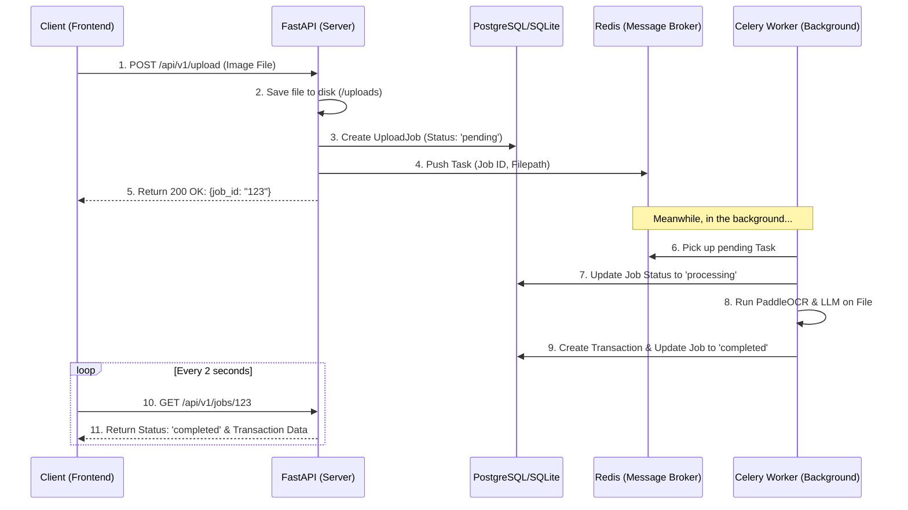

# Asynchronous Image Processing Architecture

This document outlines the architecture, technology choices, and step-by-step plan for converting the heavy, synchronous OCR image processing into a reliable, asynchronous background pipeline.

---

## 🏗️ 1. Why We Need This (The Problem)

Currently, image processing (OCR + LLM parsing) is **synchronous**. 
* The user uploads an image.
* The server freezes that connection while it runs PaddleOCR and LLM extraction.
* If the process takes 20 seconds and the user's network drops, or they refresh the page, the request dies. This leads to the **critical data loss** you mentioned.

## 🚀 2. The Proposed Architecture (The Solution)

We will implement a **Message Broker & Task Queue** architecture. Instead of doing the work immediately, the API will save the image, write a "ticket" (Job) in the database, and tell a background worker to handle it. The API instantly responds to the user with the Ticket ID.

### Flow Diagram

---

## 🛠️ 3. Technology Stack: What & Why

| Technology | Role | Why we are using it |
| :--- | :--- | :--- |
| **Redis** | Message Broker | It acts as the "middleman" holding the queue of tasks. It is extremely fast (in-memory) and acts as the standard glue between APIs and Background Workers. |
| **Celery** | Task Worker | The industry standard Python framework for running background jobs. It connects to Redis, pulls tasks, runs them safely, and handles retries if something crashes. |
| **Docker** | Infrastructure | Ensures that our API, Redis, and Celery worker all run in the same isolated environment and network without configuration headaches. |

---

## 🗄️ 4. Database Changes

We need a way to track the status of these background tasks so the API can tell the user what is happening.

We will create a new SQLAlchemy model: **`UploadJob`**
* `id`: UUID (Primary Key)
* `filename`: String (Path to the saved image)
* `status`: Enum (`pending`, `processing`, `completed`, `failed`)
* `error_message`: String (Nullable, stores error traces if OCR fails)
* `transaction_id`: UUID (Nullable, linked to the `Transaction` once completed)
* `created_at`: DateTime

---

## 🪜 5. Step-by-Step Implementation Plan

Since you want to write the code yourself to learn, here is the exact order we will tackle this:

### Phase 1: Infrastructure (In Progress ⏳)
- [x] Add `celery` and `redis` to `requirements.txt`.
- [x] Setup `docker-compose.yml` with Redis and FastAPI.
- [ ] Add the `celery_worker` service to `docker-compose.yml`.

### Phase 2: Database Preparation
- [ ] Create the `UploadJob` SQLAlchemy model.
- [ ] Generate and apply Alembic migrations.

### Phase 3: The Celery Application
- [ ] Create `app/core/celery_app.py` to initialize Celery and connect it to Redis.
- [ ] Create `app/tasks/process_image.py` containing the logic that actually runs OCR and hits the database.

### Phase 4: API Restructuring
- [ ] Create the `uploads/` directory logic to store images safely.
- [ ] Update the `POST /upload` endpoint to trigger the Celery task.
- [ ] Create the `GET /jobs/{job_id}` endpoint for the frontend to poll for status.

---

> [!TIP]
> **Shared Volumes Concept**
> Because your API and your Celery worker will run in two separate Docker containers, they both need access to the uploaded images. We will handle this by mapping a shared `uploads/` folder volume in `docker-compose.yml` to both containers!

## Approval Required
Please review this architecture document. If everything makes sense and you are ready to continue, approve this plan and we will move to finishing **Phase 1** (Adding the Celery worker to Docker)!
